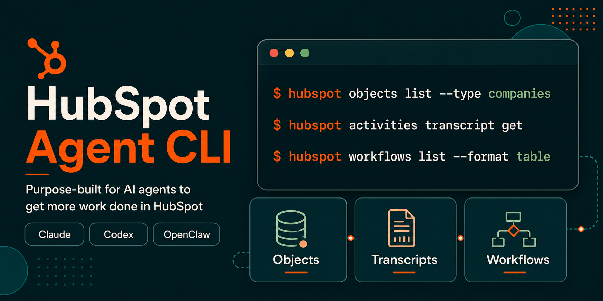

# HubSpot Agent CLI



The HubSpot Agent CLI is a command-line tool for AI agents and technical users who need to work directly with HubSpot CRM data from a local or agent workspace.

This repository is the public home for HubSpot Agent CLI releases, version history, issue tracking, and documentation links. The CLI should be installed using the instructions and prompts included below.

> [!WARNING]
> The HubSpot Agent CLI is currently in beta. Commands, flags, and behavior may change without notice. Write operations such as create, update, and delete can modify or permanently delete live CRM data. Test in a sandbox account when possible and use `--dry-run` before applying mutations.

## Documentation

- [Documentation: Install and use the HubSpot Agent CLI](https://developers.hubspot.com/docs/developer-tooling/local-development/agent-cli/guide)
- [HubSpot Knowledge Base: Use the HubSpot Agent CLI](https://knowledge.hubspot.com/integrations/use-the-hubspot-agent-cli)
- [HubSpot Agent CLI Skills](https://github.com/hubspot/agent-cli-skills)
- [Releases](https://github.com/hubspot/agent-cli/releases)
- [Issues](https://github.com/hubspot/agent-cli/issues)

## Installation

The Agent CLI is packaged as a single binary with no runtime dependencies. It is supported on macOS, Linux, and Windows.

### Install in an AI-agent workspace

If you are setting up the CLI for use with an AI agent such as Claude Code, Claude Cowork, or OpenAI Codex, provide the prompt below to your agent:

```text
Install the HubSpot Agent CLI in this agent workspace. If this workspace uses a POSIX shell (macOS, Linux, WSL, or Bash), run `curl -fsSL https://api.hubapi.com/hub/cli/backend/hub-cli/latest/install.sh | sh`. If it uses Windows PowerShell, run `irm https://api.hubapi.com/hub/cli/backend/hub-cli/latest/install.ps1 | iex`. Then authenticate with `hubspot auth login`, install HubSpot Agent CLI Skills with `npx skills add hubspot/agent-cli-skills`, and use `hubspot --help` to explore what's available.
```

Agents can discover CLI capabilities with `--help` at any level of the command tree:

```shell
hubspot --help
hubspot objects --help
hubspot objects list --help
```

### Install manually

Install the latest Agent CLI binary for your operating system.

**macOS and Linux**

```shell
curl -fsSL https://api.hubapi.com/hub/cli/backend/hub-cli/latest/install.sh | sh
```

**Windows PowerShell**

```powershell
irm https://api.hubapi.com/hub/cli/backend/hub-cli/latest/install.ps1 | iex
```

The installer adds the CLI to your `PATH`. After installation, open a new terminal window or tab so the `PATH` change takes effect.

Verify the installation:

```shell
hubspot --version
```

### Add HubSpot Agent CLI Skills

If you installed the CLI for use in an AI-agent workspace, install HubSpot Agent CLI Skills in that same workspace:

```shell
npx skills add hubspot/agent-cli-skills
```

The skills give compatible agents HubSpot-specific guidance for CRM lookup, bulk operations, data quality, workflow automation, and related tasks. To inspect the skills before installing them, see the [hubspot/agent-cli-skills](https://github.com/hubspot/agent-cli-skills) repository.

## Authentication

After installing the CLI, authenticate with your HubSpot account:

```shell
hubspot auth login
```

This opens a browser window where you can authorize the CLI. The resulting token is scoped to your HubSpot user permissions and is refreshed automatically.

Confirm your authenticated account and token type:

```shell
hubspot whoami
```

To clear cached credentials:

```shell
hubspot auth logout
```

For admin or automation workflows that require account-level access, the CLI also supports service key tokens through the `HUBSPOT_ACCESS_TOKEN` environment variable. See [Admin mode via service key token](https://developers.hubspot.com/docs/developer-tooling/local-development/agent-cli/guide) for details on OAuth behavior, service key setup, and auth-sensitive commands.

## Keep the CLI up to date

Choose the update path that matches how you installed the CLI.

### Installed on your computer

Download and install the latest Agent CLI binary:

```shell
hubspot upgrade
```

If you also installed HubSpot Agent CLI Skills in this workspace, update the skills library:

```shell
npx skills update
```

### Installed in an agent workspace

Provide the prompt below to your AI agent:

```text
Use the command `hubspot upgrade` in the workspace you previously installed the HubSpot Agent CLI to get the latest version. Then use `npx skills update` in the same workspace to check for new or updated HubSpot Agent CLI Skills. Confirm when both commands have completed successfully or if there were any errors and the appropriate resolution steps.
```

### Disable automatic upgrades

Technical users who rely on generated scripts can disable automatic upgrade checks to keep CLI behavior consistent while those scripts are reviewed.

```shell
export HUBSPOT_NO_AUTO_UPGRADE=1
```

Confirm the CLI version your scripts will use:

```shell
hubspot --version
```

This setting applies to automatic upgrade checks for normal commands. You can still install an update explicitly with `hubspot upgrade`.

## Network access

The CLI installer, upgrade flow, and commands communicate with HubSpot through `api.hubapi.com`. If your agent workspace runs in a managed environment with outbound network restrictions, your administrator may need to allowlist `api.hubapi.com`. For further information and instructions for administrators of Claude and Codex Desktop apps, see [Using the CLI with Claude Cowork](https://developers.hubspot.com/docs/developer-tooling/local-development/agent-cli/guide#using-the-cli-with-claude-cowork).

## Reporting issues

Use [GitHub Issues](https://github.com/hubspot/agent-cli/issues) to report bugs, request improvements, or share feedback about the HubSpot Agent CLI. Include the CLI version from `hubspot --version`, the command you ran, the expected result, and the actual result.

## Terms

By using the HubSpot Agent CLI beta, you agree to HubSpot's [Developer Terms](https://legal.hubspot.com/developer-terms) and [Developer Beta Terms](https://legal.hubspot.com/developerbetaterms).
